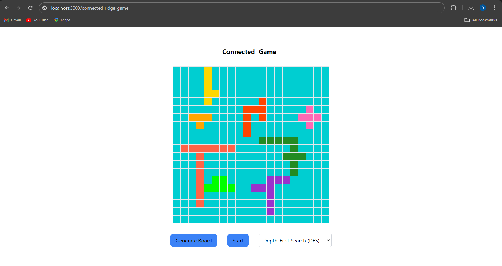

Unfortunately, the last branch for this repository is missing, and the current branch is an old branch that does not contain most of the content.

# Connected Bridge Game

This is a web application that generates a connected bridge game grid and solves it using various algorithms. The application is built with an Express.js server and features depth-first search, breadth-first search, A*, and hill climbing algorithms.

## Screenshots:

# Game Rules:

The game is played on an 𝑛×𝑚 grid where each cell can either represent wild land or water. Connected wild cells form islands, while connected water cells constitute the sea. The entire grid ensures all water cells are connected, forming a continuous sea. Players can move islands left, right, up, or down, provided there are no grid border crossings or collisions with other islands. The objective is to strategically move the islands to create a continuous connection of wild cells from the first row to the last row of the grid.

## Features

- **Grid Generation**: Generate a random connected bridge game grid.
- **Solver Algorithms**: Choose from multiple algorithms to solve the grid:
  - Depth-First Search
  - Breadth-First Search
  - A*
  - Hill Climbing
- **Real-Time Visualization**: Visualize the grid and solver process in real-time using HTML and socket.io.

## Socket Communication

The server and the client communicate through websockets using `socket.io`. This allows real-time updates and interaction between the server-side solver and the client-side visualization.

## Solver Algorithms

### Depth-First Search (DFS)

DFS explores as far as possible along each branch before backtracking. It uses a stack data structure to keep track of the next node to visit.

### Breadth-First Search (BFS)

BFS explores all the nodes at the present depth level before moving on to the nodes at the next depth level. It uses a queue data structure to keep track of the nodes to be explored.

### A*

A* is a popular search algorithm that uses heuristics to improve search efficiency. It combines the cost to reach the node and the estimated cost to reach the goal.

### Hill Climbing

Hill climbing is a mathematical optimization technique that belongs to the family of local search. It starts with an arbitrary solution to a problem and iteratively makes small changes to the solution, each time improving it.

